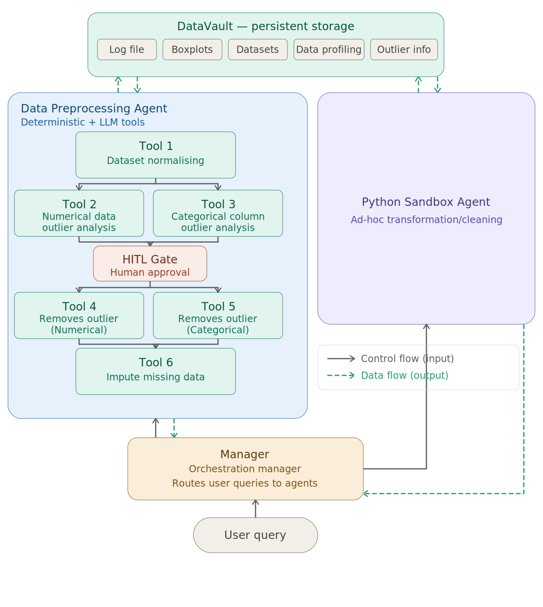

# Automated Data Cleaning Agent

A multi-agent AI pipeline for automated dataset cleaning and preprocessing. A central orchestrator routes user queries to specialised agents that handle deterministic cleaning, LLM-based outlier analysis, human-in-the-loop review, and ad-hoc Python transformations.

Built with **CrewAI** for agent orchestration, **ydata-profiling** for before/after dataset snapshots, **sentence-transformers** for semantic categorical merging, **DBSCAN** for numerical outlier clustering, and an LLM-assisted imputation strategy backed by **FancyImpute** for statistical gap-filling.

> **Work in progress** — pipeline is actively being developed.

> **Other Completed Agent Project** — [YouTube Knowledge RAG Agent](https://github.com/TvlanS/Youtube-Knowledge-RAG-Agent) , [Machine Learning Agent](https://github.com/TvlanS/Machine-Learning-Agent)

---

## Pipeline Overview

<div align="center">
  
  <br>
  <em>Multi-Agent Data Cleaning Pipeline</em>
</div>

---

## Architecture

```
User Query
    │
    ▼
Manager (Orchestrator)
    ├──► Data Preprocessing Agent  ──► DataVault
    └──► Python Sandbox Agent      ──► DataVault
```

All outputs — cleaned datasets, profiling reports, outlier diagnostics, and execution logs — are persisted in the **DataVault** storage layer under `data/runs/{dataset}_{timestamp}/`.

---

## Agents

| Agent | Role | Type |
|---|---|---|
| **Manager** | Receives user query, routes to the correct agent | Orchestrator |
| **Data Preprocessing Agent** | Runs the full sequential/parallel cleaning pipeline | Deterministic + LLM |
| **Python Sandbox Agent** | Executes ad-hoc Python transformations on request | Code execution |

---

## Tools

| Tool | File | Phase | Type | What It Does |
|---|---|---|---|---|
| `DataCleaningTool` | `tools/normalise_cleaning_tool.py` | 1 | Deterministic | Strips whitespace, lowercases headers and categorical values, removes duplicate rows, drops sparse rows/columns exceeding configurable thresholds. Generates ydata-profiling reports before and after. Fully resumable via `agent_log.json`. |
| `NumericalOutlierAnalyzer` | `tools/num_cleaner.py` | 2A | LLM-based | Detects outliers per numeric column via IQR fencing, then runs DBSCAN on the outlier values to distinguish clustered anomalies from scattered noise. Reports outlier %, IQR range, mean, mode, and cluster summary. |
| `CatOutlierCleaner` / `SemanticMerger` | `tools/cat_cleaner.py` | 2B | LLM-based | Builds a cosine-similarity graph over unique categorical values using `all-MiniLM-L6-v2`, extracts connected-component clusters, then calls an LLM to suggest canonical merge targets. Filters columns by comma density and token length to avoid free-text noise. |
| *(Tool 4)* | — | 3A | Deterministic | Removes or caps numerical outliers identified in Tool 2 *(in progress)* |
| *(Tool 5)* | — | 3B | Deterministic | Removes or replaces categorical outliers identified in Tool 3 *(in progress)* |
| *(Tool 6)* | — | 4 | LLM + FancyImpute | LLM inspects per-column statistics (distribution, skew, null %) to decide the best imputation strategy, then applies it — either via an LLM-reasoned fill or a FancyImpute method (e.g. KNN, IterativeImputer) *(in progress)* |

---

## DataVault — Output Layout

```
data/runs/{dataset}_{YYYYMMDD}_{HHMMSS}/
├── agent_log.json
├── pipeline_config.json
├── input/
│   └── raw_dataset.*
├── profiling/
│   ├── 01_before_cleaning/
│   │   ├── report.html
│   │   └── summary.json
│   └── 02_after_cleaning/
│       ├── report.html
│       └── summary.json
└── step_1_cleaning/
    ├── dataset.csv
    └── summary.json
```

---

## Key Features

- **Resumable pipeline** — each sub-step is checkpointed in `agent_log.json`; re-running skips completed steps
- **HITL gate** — human reviews outlier reports before any removal is applied
- **Parallel analysis** — numerical and categorical outlier analysis run concurrently
- **Semantic deduplication** — graph-based cosine clustering merges near-duplicate category values
- **Before/after profiling** — full ydata-profiling HTML reports at each major stage
